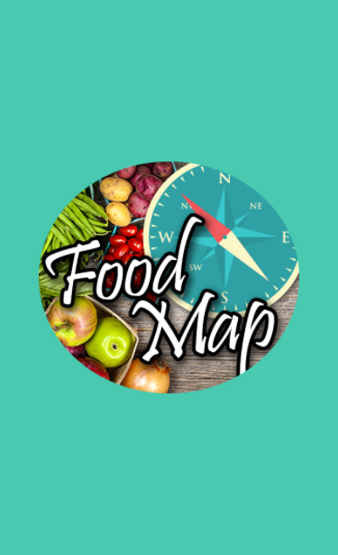
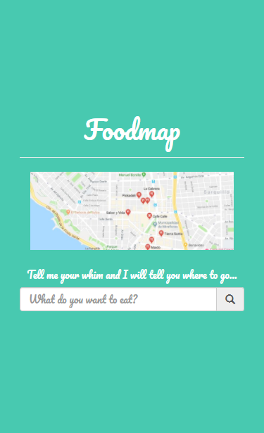

# Foodmap App
## Descripción
Este repositorio contiene una web-app que a través de un input, ingresando un tipo de comida, filtra los restaurantes más cercanos.

## Herramientas
+ HTML5
+ CSS3
+ jQuery
+ Bootstrap

## Flujo de la aplicación
1. Splash: `index.html`
2. Vista principal: `foodmap.html`

## Producto final
+ #### Splash

+ #### Vista principal

